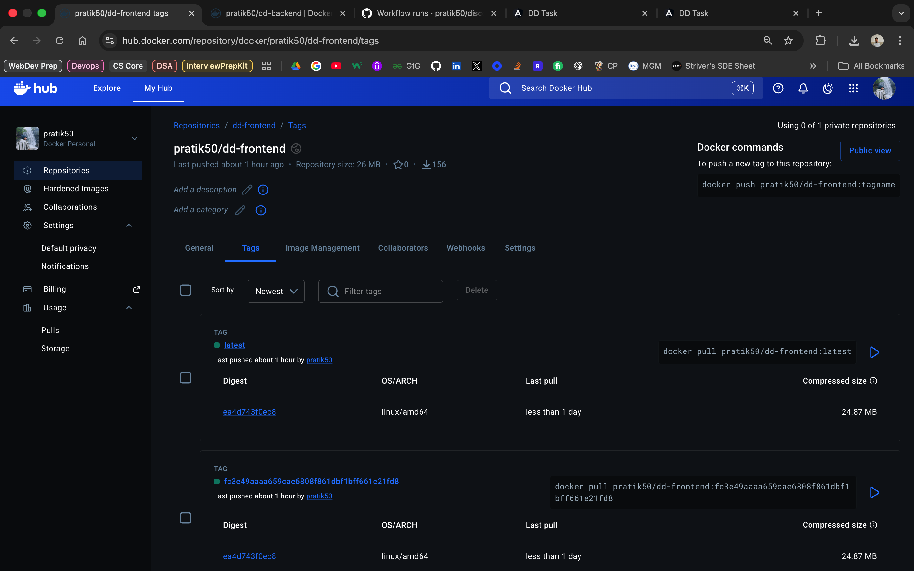
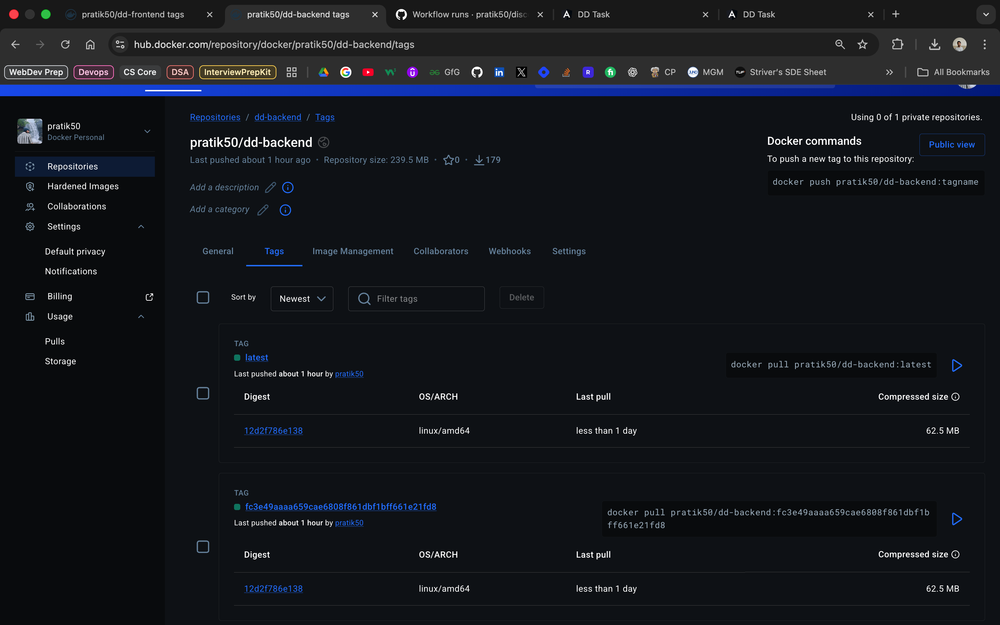
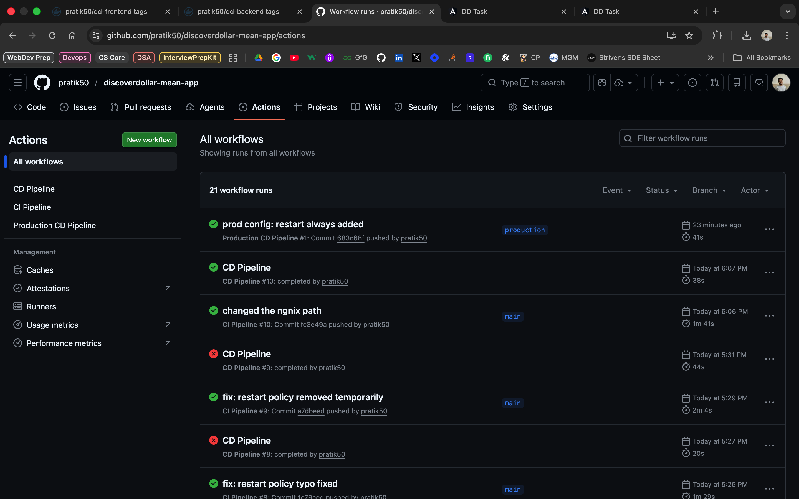
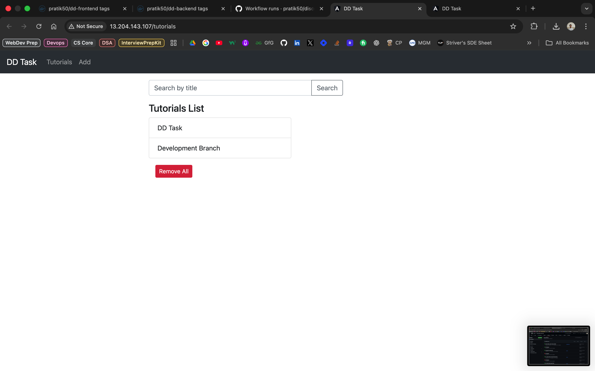
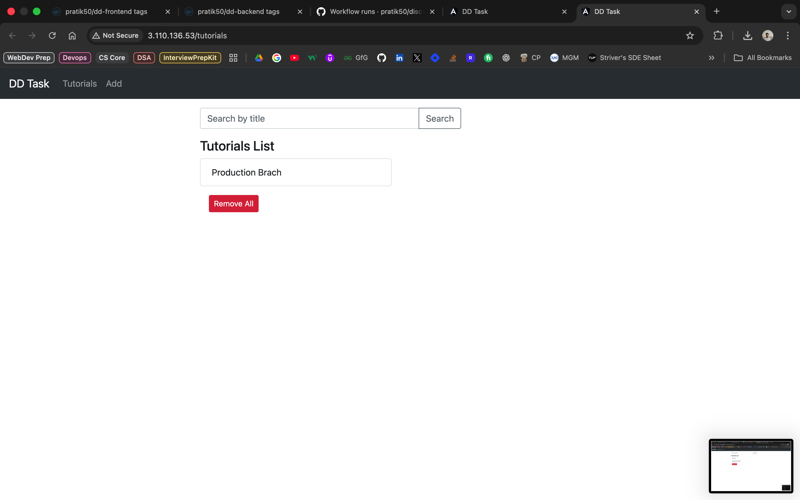
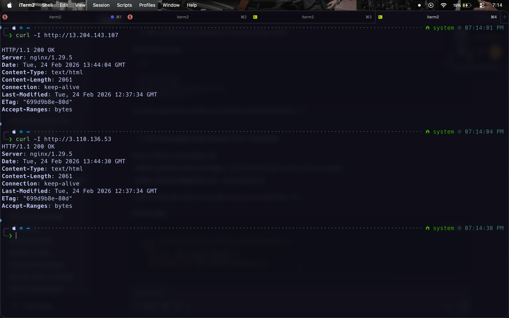

# DiscoverDollar MEAN App — DevOps Assignment

A full-stack CRUD application built with the MEAN stack (MongoDB, Express, Angular 15, Node.js), containerized with Docker, deployed on AWS EC2, and automated via GitHub Actions CI/CD pipelines.

---

## Live Deployments

| Environment | URL |
|---|---|
| Development | http://13.204.143.107 |
| Production | http://3.110.136.53 |

---

## Tech Stack

| Layer | Technology |
|---|---|
| Frontend | Angular 15 |
| Backend | Node.js + Express |
| Database | MongoDB 6 (Docker image) |
| Containerization | Docker + Docker Compose |
| Reverse Proxy | Nginx |
| CI/CD | GitHub Actions |
| Cloud | AWS EC2 (Ubuntu 24.04) |

---

## Project Structure

```
discoverdollar-mean-app/
├── backend/
│   ├── app/
│   │   ├── config/
│   │   │   └── db.config.js
│   │   ├── models/
│   │   └── routes/
│   ├── server.js
│   ├── package.json
│   └── Dockerfile
├── frontend/
│   ├── src/
│   ├── angular.json
│   ├── package.json
│   └── Dockerfile
├── .github/
│   └── workflows/
│       ├── ci.yml
│       └── cd.yml
├── nginx.conf
└── docker-compose.yml
```

---

## Architecture

```
User Request (Port 80)
        │
        ▼
   Nginx Reverse Proxy
        │
        ├──── /api/*  ──────► Backend (Node.js :8080)
        │                           │
        │                           ▼
        │                     MongoDB (:27017)
        │
        └──── /  ───────────► Frontend (Angular/Nginx :80)
```

---

## Dockerfiles

### Backend Dockerfile

```dockerfile
FROM node:18-alpine

WORKDIR /app

COPY package*.json .

RUN npm install

COPY . .

EXPOSE 8080

CMD ["node", "server.js"]
```

### Frontend Dockerfile

```dockerfile
FROM node:18-alpine AS build

WORKDIR /app

COPY package*.json .

RUN npm install

COPY . .

RUN npm run build --prod

FROM nginx:alpine

COPY --from=0 /app/dist/angular-15-crud /usr/share/nginx/html

EXPOSE 80

CMD ["nginx", "-g", "daemon off;"]
```

---

## Docker Compose

```yaml
version: '3.8'

services:
  mongodb:
    image: mongo:6
    container_name: mongodb
    volumes:
      - mongo_data:/data/db
    restart: unless-stopped

  backend:
    image: pratik50/dd-backend:latest
    container_name: backend
    environment:
      - MONGODB_URI=mongodb://mongodb:27017/dd_db
    depends_on:
      - mongodb
    restart: unless-stopped

  frontend:
    image: pratik50/dd-frontend:latest
    container_name: frontend
    depends_on:
      - backend
    restart: unless-stopped

  nginx:
    image: nginx:alpine
    container_name: nginx
    ports:
      - "80:80"
    volumes:
      - ~/app/nginx.conf:/etc/nginx/conf.d/default.conf
    depends_on:
      - frontend
      - backend
    restart: unless-stopped

volumes:
  mongo_data:
```

---

## Nginx Configuration

```nginx
upstream backend {
    server backend:8080;
}

server {
    listen 80;

    location /api/ {
        proxy_pass http://backend;
    }

    location / {
        proxy_pass http://frontend;
        proxy_intercept_errors on;
        error_page 404 = /index.html;
    }
}
```

- All traffic enters via **port 80**
- `/api/*` requests are proxied to the Node.js backend container
- `/` requests are proxied to the Angular frontend container
- Angular SPA routing is handled by redirecting 404s to `index.html`

---

## CI/CD Pipeline

### Overview

Two separate GitHub Actions pipelines:

| Pipeline | Trigger | Job |
|---|---|---|
| CI | Push to `main` | Build Docker images → Push to Docker Hub |
| CD (Dev) | CI Pipeline completes successfully | SSH into Dev VM → Pull latest images → Restart containers |
| CD (Prod) | Push to `production` branch | SSH into Prod VM → Pull latest images → Restart containers |

### CI Pipeline (`.github/workflows/ci.yml`)

```yaml
name: CI Pipeline

on:
  push:
    branches:
      - main

jobs:
  build:
    runs-on: ubuntu-latest

    steps:
      - name: Checkout code
        uses: actions/checkout@v3

      - name: Set up QEMU
        uses: docker/setup-qemu-action@v3

      - name: Set up Docker Buildx
        uses: docker/setup-buildx-action@v3

      - name: Login to Docker Hub
        uses: docker/login-action@v3
        with:
          username: ${{ secrets.DOCKER_USERNAME }}
          password: ${{ secrets.DOCKER_PASSWORD }}

      - name: Build and push backend
        uses: docker/build-push-action@v5
        with:
          context: ./backend
          file: ./backend/Dockerfile
          push: true
          tags: |
            ${{ secrets.DOCKER_USERNAME }}/dd-backend:${{ github.sha }}
            ${{ secrets.DOCKER_USERNAME }}/dd-backend:latest
          platforms: linux/amd64

      - name: Build and push frontend
        uses: docker/build-push-action@v5
        with:
          context: ./frontend
          file: ./frontend/Dockerfile
          push: true
          tags: |
            ${{ secrets.DOCKER_USERNAME }}/dd-frontend:${{ github.sha }}
            ${{ secrets.DOCKER_USERNAME }}/dd-frontend:latest
          platforms: linux/amd64
```

### CD Pipeline — Dev (`.github/workflows/cd.yml`)

```yaml
name: CD Pipeline

on:
  workflow_run:
    workflows: ["CI Pipeline"]
    types:
      - completed

jobs:
  deploy:
    runs-on: ubuntu-latest
    if: ${{ github.event.workflow_run.conclusion == 'success' }}

    steps:
      - name: Deploy to EC2 via SSH
        uses: appleboy/ssh-action@v1
        with:
          host: ${{ secrets.VM_HOST }}
          username: ${{ secrets.VM_USER }}
          key: ${{ secrets.VM_SSH_KEY }}
          script: |
            set -e
            APP_DIR=~/app
            if [ ! -d "$APP_DIR" ]; then
              git clone --depth 1 https://github.com/pratik50/discoverdollar-mean-app.git $APP_DIR
            else
              cd $APP_DIR
              git fetch origin main
              git reset --hard origin/main
            fi
            cd $APP_DIR
            docker compose pull
            docker compose up -d --remove-orphans --force-recreate
            docker image prune -af
```

### CD Pipeline — Production (`.github/workflows/cd-production.yml`)

```yaml
name: Production CD Pipeline

on:
  push:
    branches:
      - production

jobs:
  deploy:
    runs-on: ubuntu-latest

    steps:
      - name: Deploy to Production EC2 via SSH
        uses: appleboy/ssh-action@v1
        with:
          host: ${{ secrets.PROD_VM_HOST }}
          username: ${{ secrets.PROD_VM_USER }}
          key: ${{ secrets.PROD_VM_SSH_KEY }}
          script: |
            set -e
            APP_DIR=~/app
            if [ ! -d "$APP_DIR" ]; then
              git clone --depth 1 https://github.com/pratik50/discoverdollar-mean-app.git $APP_DIR
            else
              cd $APP_DIR
              git fetch origin production
              git reset --hard origin/production
            fi
            cd $APP_DIR
            docker compose pull
            docker compose up -d --remove-orphans --force-recreate
            docker image prune -af
```

### GitHub Secrets Required

| Secret | Description |
|---|---|
| `DOCKER_USERNAME` | Docker Hub username |
| `DOCKER_PASSWORD` | Docker Hub password |
| `VM_HOST` | Dev EC2 public IP |
| `VM_USER` | EC2 SSH user (`ubuntu`) |
| `VM_SSH_KEY` | Dev EC2 private key (.pem content) |
| `PROD_VM_HOST` | Prod EC2 public IP |
| `PROD_VM_USER` | Prod EC2 SSH user (`ubuntu`) |
| `PROD_VM_SSH_KEY` | Prod EC2 private key (.pem content) |

---

## Docker Hub

Images are available at: https://hub.docker.com/repositories/pratik50

| Image | Tags |
|---|---|
| `pratik50/dd-backend` | `latest`, `<git-sha>` |
| `pratik50/dd-frontend` | `latest`, `<git-sha>` |

Git SHA tags allow rollback to any previous version.

---

## Local Setup & Development

### Prerequisites

- Docker Desktop
- Node.js 18+
- Angular CLI

### Run Locally with Docker

```bash
git clone https://github.com/pratik50/discoverdollar-mean-app.git
cd discoverdollar-mean-app
docker compose up --build
```

App will be available at `http://localhost`

### Run Without Docker

```bash
# Start MongoDB
docker run -d -p 27017:27017 --name mongodb mongo:6

# Backend
cd backend
npm install
node server.js

# Frontend (new terminal)
cd frontend
npm install
npx ng serve --port 8081
```

Frontend: `http://localhost:8081`

---

## AWS Infrastructure

| Resource | Dev | Prod |
|---|---|---|
| Instance Type | t2.micro | t2.micro |
| OS | Ubuntu 24.04 | Ubuntu 24.04 |
| Region | ap-south-1 | ap-south-1 |
| Public IP | 13.204.143.107 | 3.110.136.53 |
| Port Open | 22, 80 | 22, 80 |

### Docker Installation on EC2

As per [this](https://docs.docker.com/engine/install/ubuntu/) guide, run the following commands:
```bash
sudo apt-get update
sudo apt-get install -y ca-certificates curl
sudo install -m 0755 -d /etc/apt/keyrings
sudo curl -fsSL https://download.docker.com/linux/ubuntu/gpg -o /etc/apt/keyrings/docker.asc
sudo chmod a+r /etc/apt/keyrings/docker.asc

sudo apt-get update
sudo apt-get install -y docker-ce docker-ce-cli containerd.io docker-buildx-plugin docker-compose-plugin
sudo usermod -aG docker ubuntu
newgrp docker
```

---

## Screenshots

### 1. Docker Hub with pushed images for backend and frontend




### 2. CI/CD pipeline running on GitHub Actions (Main and Production)


### 3. Working Development site


### 4. Working production site


### 5. Nginx serving the app on port 80



---

## Repository

GitHub: https://github.com/pratik50/discoverdollar-mean-app